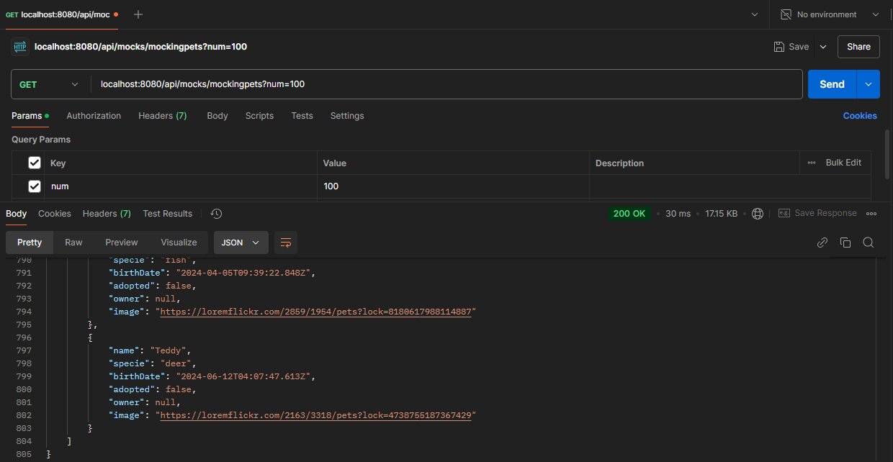
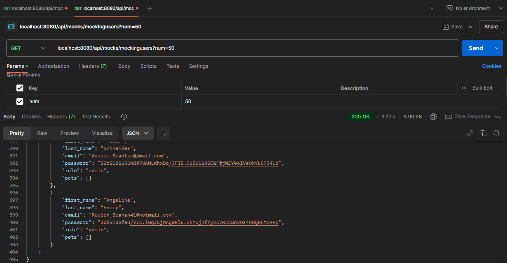
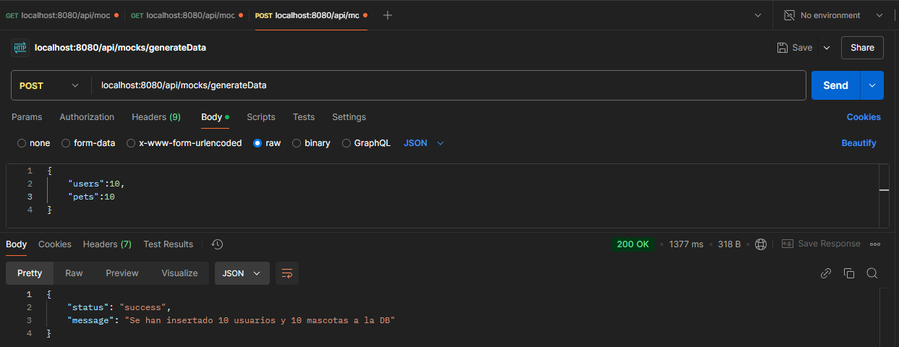
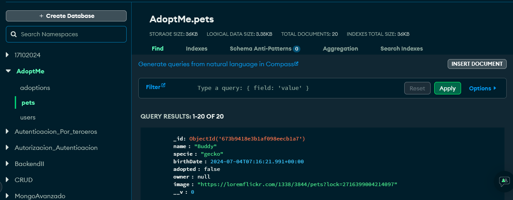
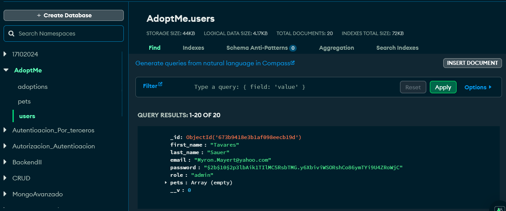
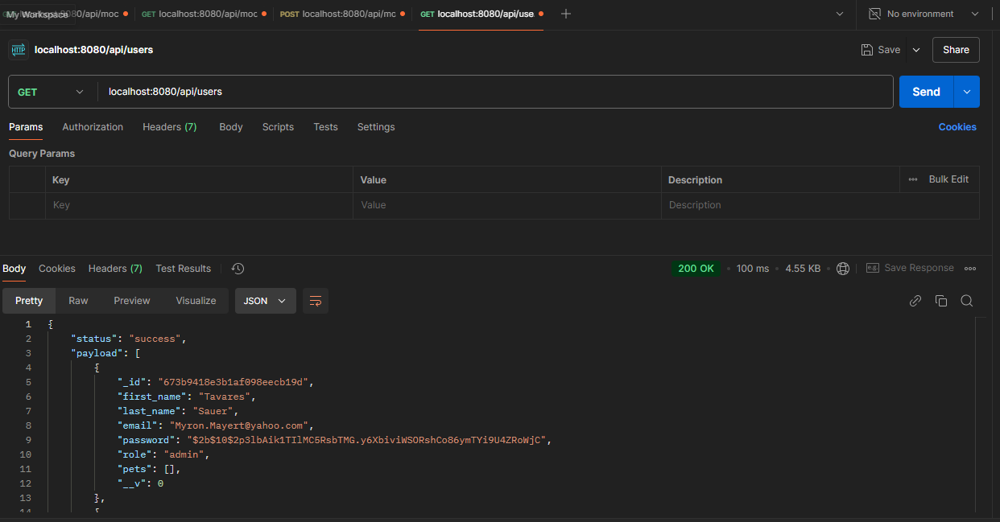
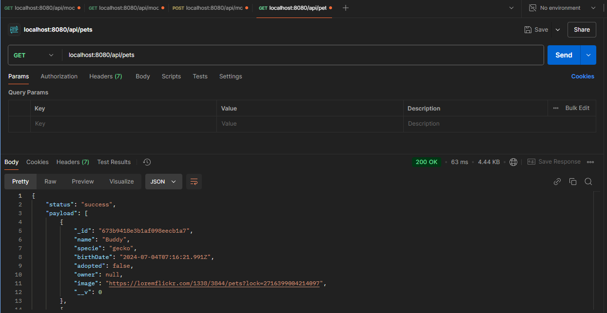

# Aplicación Backend **Adoptme**

## Nombre del Proyecto: Adoptme - BACKEND III:

Utilizacion del repositorio "RecursosBackend-Adoptme" para la entrega de la cursada de Backend III.

### Demostración del funcionamiento con screenshots de POSTMAN y MONGODB:

#Creando 'pets' mediante MockingPets:

#Creando 'users' mediante MockingUsers:

#Creando 'pets' y 'users' mediante cantidades en el GenerateData:

#Visualización de algunos registros en la db 'ADOPTME' colección 'pets':

#Visualización de algunos registros en la db 'ADOPTME' colección 'users':

#GetUsers en POSTMAN:

#GetPets en POSTMAN:

## Autores y reconocimientos
* Mauricio Espinosa Flores - Desarrollador principal
* Fabio Bianchi - Desarrollador secundario

## Contacto y soporte
Para preguntas o soporte, contacta a coder@house.com.
