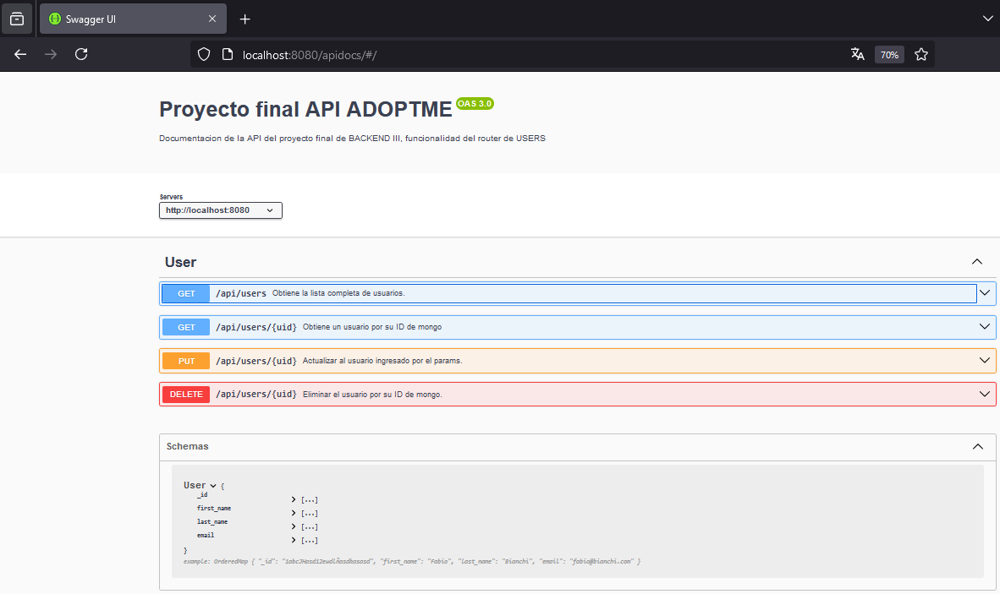
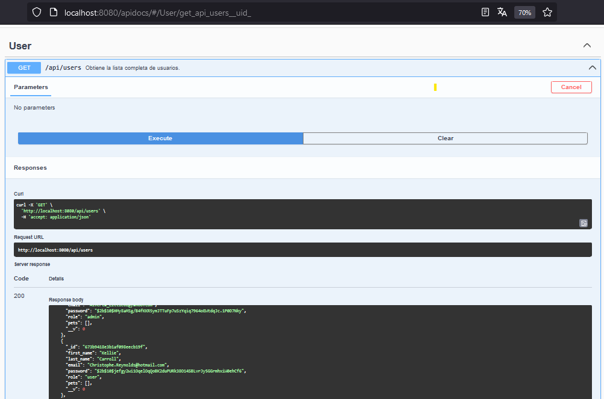

# Aplicación Backend **Adoptme**

## Nombre del Proyecto: Adoptme - BACKEND III:

Utilizacion del repositorio "RecursosBackend-Adoptme" para la entrega de la cursada de Backend III.

## Actualizaciones para la pre entrega final de la cursada BACKEND III:

### Demostración del funcionamiento con screenshots de POSTMAN y MONGODB:

#Creando 'pets' mediante MockingPets:

#Creando 'users' mediante MockingUsers:

#Creando 'pets' y 'users' mediante cantidades en el GenerateData:

#Visualización de algunos registros en la db 'ADOPTME' colección 'pets':

#Visualización de algunos registros en la db 'ADOPTME' colección 'users':

#GetUsers en POSTMAN:

#GetPets en POSTMAN:

## Actualizaciones para la entrega final de la cursada BACKEND III:

#### Puntos a entregar:
- Documentar con swagger el modulo de "Users".
- Desarrollar los test funcionales para todos los endpoints del router "adoption.router.js"
- Desarrollar el Dockerfile para generar una imagen del proyecto.
- Subir la imagen de Docker a Dockerhub y añadir en un ReadMe.md al proyecto que contenga el link de dicha imagen.

## Muestras de documentacion:

#Inicio de la interfaz de swagger con los endpoints del router Users:

#GetUserWithSwagger:

## Autores y reconocimientos
* Mauricio Espinosa Flores - Desarrollador principal
* Fabio Bianchi - Desarrollador secundario

## Contacto y soporte
Para preguntas o soporte, contacta a coder@house.com.
